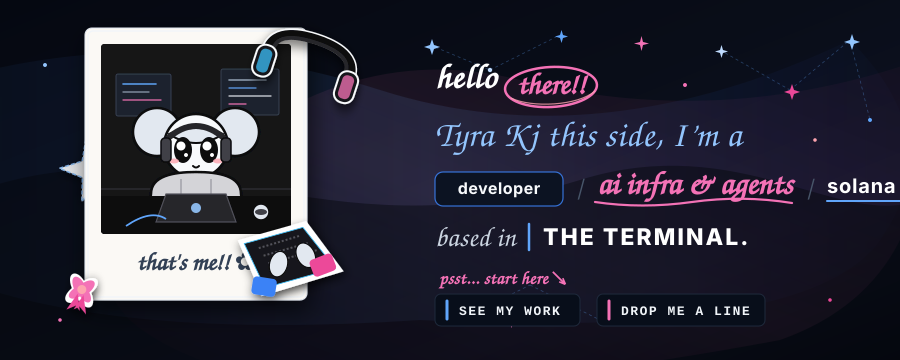
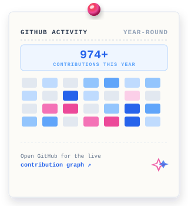

<!-- ╔══════════════════════════════════════════════╗ -->
<!-- ║             HERO SCRAPBOOK BANNER            ║ -->
<!-- ╚══════════════════════════════════════════════╝ -->

  

  <em>"Most of my time goes into figuring out how <b>complex systems break</b> and building better alternatives. From <b>SVM &amp; EVM protocols to deep learning models</b>—if it solves an actual friction, I want to build it."</em>

<!-- ─── DIVIDER ─────────────────────────────────────────────── -->

## 🛠️ Tech Stack

 
 

 

| Category | Technologies |
|:---|:---|
| **Languages** | TypeScript · Python · Rust · Solidity · JavaScript · C++ |
| **Frontend & Mobile** | React · Next.js · React Native · TailwindCSS · Vite |
| **Backend & Systems** | FastAPI · Node.js · Redis · PostgreSQL · Docker · Apache Kafka |
| **AI & Deep Learning** | PyTorch · CUDA · TensorFlow · Hugging Face Transformers · LangGraph |
| **Web3 & Protocols** | Anchor · SVM · EVM · ethers.js · viem · Hardhat · Solidity · OpenZeppelin |
| **Infra & Tooling** | Docker · Linux · GitHub Actions · Vercel · Git |

<!-- ─── DIVIDER ─────────────────────────────────────────────── -->

## 🚀 Featured Projects

### ⚡ Solaxis — Sovereign Serverless Micro-Instance Engine for Solana

> Execute zero-gas, sub-10ms compute loops offloaded from Solana L1 into **Ephemeral Rollups (ER)** and **Private Ephemeral Rollups (PER inside Intel TDX TEE enclaves)** — with atomic on-chain settlement.

* **Core Innovation:** Turns Solana PDAs into on-demand serverless micro-VMs (~65x faster than L1 block times) with confidential hardware enclaves and atomic L1 state commits.
* **Stack:** `Anchor` · `Rust` · `MagicBlock ER SDK` · `Intel TDX TEE` · `Next.js 15` · `TypeScript SDK`
* 🔗 [View Repository](https://github.com/Team-Managed/Solaxis)

---

### 📱 AirLink — Remote AI Agent Harness

> Remotely prompt, stream tokens, inspect Git diffs, and approve destructive operations on your **local AI coding agent from your mobile phone** — without opening a single inbound port.

* **Core Innovation:** Outbound WebSocket relay tunneling to local MCP tool servers, 500-event ring buffer for instant reconnection catch-up, and 180s human-in-the-loop approval drawers.
* **Stack:** `React Native` · `Expo` · `MCP Tools` · `TrueForge SDK` · `WebSockets`
* 🔗 [View Repository](https://github.com/Team-Managed/AirLink)

---

### 🔒 Privacy & Semantic Cache Proxy

> An OpenAI-API-compatible gateway that **masks PII before it leaves your infrastructure**, caches semantically-similar queries via vector similarity search, and streams real-time rehydrated responses.

* **Core Innovation:** Sliding buffer streaming unmasking hooks, Shannon entropy secrets scanner, and Redis-backed semantic vector lookup to cut LLM inference costs with zero data exposure.
* **Stack:** `LiteLLM` · `Presidio` · `Redis` · `Qdrant` · `Python`
* 🔗 [View Repository](https://github.com/tyraakj/privacy-semantic-cache-proxy) · 📖 [Architecture Deep-Dive](https://github.com/tyraakj/privacy-semantic-cache-proxy/blob/main/ARCHITECTURE.md)

---

### ⛓️ Vaulted — Gasless Freelance Escrow Protocol

> A **non-custodial freelance escrow platform** on Base Sepolia. Payment locks on-chain on job creation and releases only upon verified delivery — neither client nor freelancer ever needs native ETH for gas.

* **Core Innovation:** Gasless meta-transaction execution via UGF SDK & ERC-3009 transfer authorizations, paired with OpenZeppelin dispute state machines and 7-day auto-release fallbacks.
* **Stack:** `React` · `Solidity` · `ethers.js` · `UGF SDK` · `OpenZeppelin` · `Base Sepolia`
* 🔗 [View Repository](https://github.com/tyraakj/Vaulted)

<!-- ─── DIVIDER ─────────────────────────────────────────────── -->

## 📊 GitHub Activity & Live Contributions

  

 

<!-- Snake Contribution Animation -->
<picture>
  <source media="(prefers-color-scheme: dark)" srcset="https://raw.githubusercontent.com/tyraakj/tyraakj/output/github-contribution-grid-snake-dark.svg" />
  <source media="(prefers-color-scheme: light)" srcset="https://raw.githubusercontent.com/tyraakj/tyraakj/output/github-contribution-grid-snake.svg" />
  
</picture>

<!-- ─── DIVIDER ─────────────────────────────────────────────── -->

## 🤝 Let's Connect

&nbsp;&nbsp;&nbsp;

&nbsp;&nbsp;&nbsp;

  

