<!-- Constellation Header -->
<p align="center">
  
</p>

<br>

<!-- Quick Bio -->
<div align="center">

```
╔══════════════════════════════════════════════════════════════════╗
║  🧠  TypeScript · Java · Python · Solidity                       ║
║  ⚡  Spring Boot · Node.js · LangGraph · OpenTelemetry           ║
║  ⛓️  Base · ethers.js · OpenZeppelin · ERC-3009                  ║
║  🔬  Presidio · Redis · Qdrant · Apache Kafka · PostgreSQL       ║
║  ☁️  AWS S3 · Docker · Supabase · Resilience4j · Vercel          ║
╚══════════════════════════════════════════════════════════════════╝
```

</div>

---

## 🌌 Who I Am


I'm a **full-stack engineer** who ships end-to-end — from polished React interfaces to the distributed systems and on-chain protocols powering them. I care as much about the pixel as the packet.

I think deeply about:
- **Frontend craft** — composable component systems, smooth interactions, and UX that feels native
- **Privacy-by-design** — keeping sensitive data out of LLM providers and observability tooling without sacrificing usability
- **Reproducibility** — evaluation pipelines that produce the same release decisions tomorrow as they do today
- **Trustless payments** — escrow logic that lives on-chain and needs no intermediary to settle

When I'm not shipping code, I'm usually designing interfaces, reading whitepapers, or auditing smart contracts.

<br clear="right"/>

---

## 🛠️ Tech Stack

<div align="center">

<br/>
<br/>


</div>

<br>

<div align="center">

| Category | Technologies |
|:---|:---|
| **Languages** | TypeScript · JavaScript · Java · Python · Solidity |
| **Frontend** | React · Vite · TailwindCSS |
| **Backend** | Spring Boot · Spring Security · Hibernate · Node.js |
| **AI & Data** | LangGraph · DSPy · IBM watsonx.ai · Presidio · OpenTelemetry |
| **Databases** | PostgreSQL · MySQL · Redis · Qdrant · Supabase |
| **Web3** | Base · ethers.js · OpenZeppelin · ERC-3009 · UGF SDK |
| **Infra** | AWS S3 · Docker · Apache Kafka · Resilience4j · Bucket4j · Vercel |

</div>

---

## 🚀 Featured Projects


### 🔒 Privacy & Semantic Cache Proxy

> An OpenAI-API-compatible proxy that **masks PII before it leaves your infrastructure**, caches semantically-similar queries to cut inference cost, and traces every exchange without ever exposing sensitive data.

```
Request → Normalize → Secrets Scan → PII Mask → Semantic Cache Lookup
                                                        ↓ (miss)
                                                  LLM Provider
                                                        ↓
Response ← Streaming Unmask ← Redis Rehydration ← Raw Response
```

| Layer | What It Does |
|:---|:---|
| **Text Normalization** | NFKC normalize · strip zero-width chars · decode Base64/URL payloads |
| **Secrets Engine** | Shannon entropy scan + regex for AWS keys, GitHub tokens, JWTs |
| **PII Masking** | Presidio detection with confidence scoring → conversation-scoped Redis map |
| **Semantic Cache** | Local embedding model → vector similarity search filtered by `user_id` |
| **Streaming Unmask** | Custom sliding buffer in `during_call`/`post_call` hooks for real-time re-hydration |

**Stack:** `LiteLLM` · `Presidio` · `Redis` · `Qdrant` · `Python`  
📖 [Architecture Deep-Dive](https://github.com/tyraakj/privacy-semantic-cache-proxy/blob/main/ARCHITECTURE.md) · 🔗 [View Repo](https://github.com/tyraakj/privacy-semantic-cache-proxy)

---

### 🔬 Evaluation Harness Pipeline

> A **reproducible AI evaluation framework** that executes versioned tasks against AI targets, captures bounded evidence, grades observable outcomes, and produces deterministic release decisions — not a model gateway, it owns the outer evaluation loop.

```
Task Registry → Trial Executor → Evidence Capture → Grader Suite
                                                          ↓
                              Baseline Comparator ← Candidate Report
                                        ↓
                              ✅ Release Decision | 🚫 Regression Flag
```

| Concept | Description |
|:---|:---|
| **Trial** | One target execution for one case — unique ID, timeout, grades, duration, provenance |
| **Deterministic Graders** | Own computable truth; optional model judges require calibration |
| **RAG Contract** | Recall@k · Precision@k · reciprocal rank with explicit thresholds |
| **Loop Contract** | Iteration ceilings, repeated-node limits, allowed terminal reasons |
| **Sandbox Provider** | User-supplied isolation — disposable filesystems, browsers, containers |

**Stack:** `Python` · `LangGraph` · `OpenTelemetry` · `DSPy`  
📖 [Architecture Deep-Dive](https://github.com/tyraakj/eval-harness-pipeline/blob/main/docs/ARCHITECTURE.md) · 🔗 [View Repo](https://github.com/tyraakj/eval-harness-pipeline)

---

### ⛓️ Vaulted — Gasless Freelance Escrow

> A **gasless on-chain escrow platform** built on Base Sepolia. Payment locks on-chain the moment a job is posted, releases only on approval — and neither party ever needs ETH. UGF handles all gas automatically.

```
Client posts job → Escrow.sol locks USDC on-chain → Freelancer delivers
                                                            ↓
                         Approval? → Release | Dispute? → State Machine
                              (7-day auto-release if no action)
```

| Component | Details |
|:---|:---|
| **Gasless Flow** | `login()` → `quote()` → `settle()` (ERC-3009) → `execute()` via UGF SDK |
| **Smart Contract** | `Escrow.sol` on OpenZeppelin — 7-day auto-release · on-chain identity · dispute state machine |
| **Architecture Rule** | *"Read with ethers, write with UGF"* — prevents MetaMask from demanding native gas |
| **Network** | Base Sepolia Testnet · Mock USD (TYI_MOCK_USD) |

**Stack:** `React` · `Solidity` · `ethers.js` · `UGF SDK` · `OpenZeppelin`  
🔗 [View Repo](https://github.com/tyraakj/Vaulted)

---

## 📊 GitHub Stats

<div align="center">


<br><br>


</div>

<br>

<!-- Snake Contribution Graph -->
<div align="center">

<picture>
  <source media="(prefers-color-scheme: dark)" srcset="https://raw.githubusercontent.com/tyraakj/tyraakj/output/github-contribution-grid-snake-dark.svg" />
  <source media="(prefers-color-scheme: light)" srcset="https://raw.githubusercontent.com/tyraakj/tyraakj/output/github-contribution-grid-snake.svg" />
  
</picture>

</div>

---

## 🏅 Open Source & Certifications

<div align="center">

| Experience | Details |
|:---|:---|
| 🌱 **Winter of Code 5.0** — GDG on Campus, IIIT Kalyani | Contributed an authentication service feature to an open-source Node.js project over a month-long collaboration with maintainers |
| 🤖 **IBM — Machine Learning with Python** | Certification |
| 💻 **IBM — Intro to Software Engineering** | Certification |
| ☕ **Oracle — Java Foundations** | Certification |

</div>

---

## 💭 Philosophy

<div align="center">

> *"The best systems are the ones that make hard constraints invisible to the user — gasless transactions, redacted PII, reproducible evaluations. The complexity should live in the architecture, not in the interface."*

</div>

---

<!-- Footer Wave -->
<p align="center">
  
</p>

<div align="center">

[](https://tyrakj.vercel.app)
[](https://www.linkedin.com/in/tyraakj/)
[](mailto:tyra191712@gmail.com)

<br>


</div>
